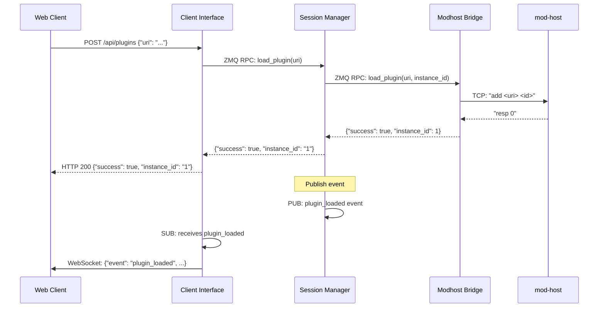
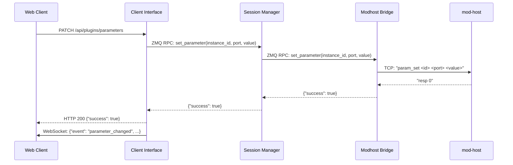
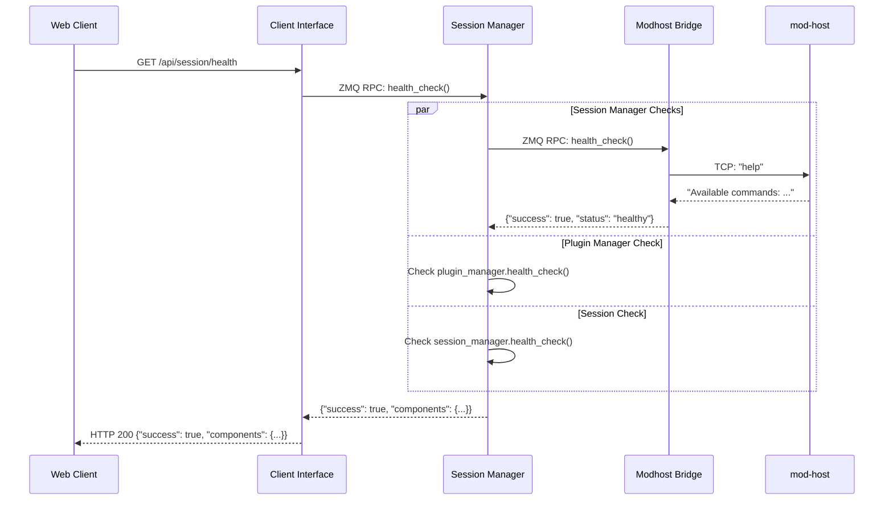
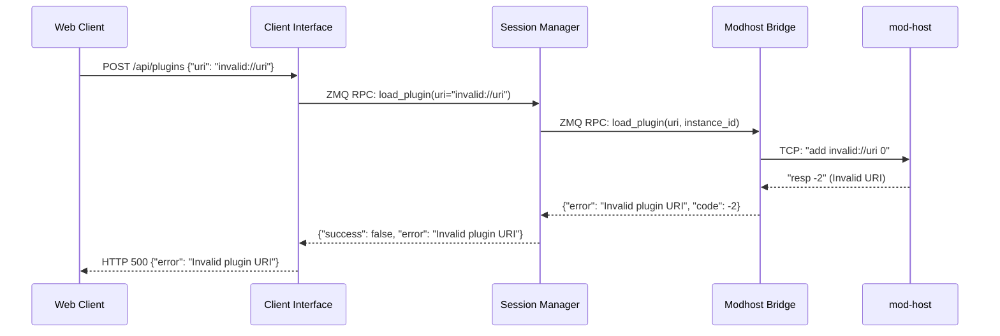
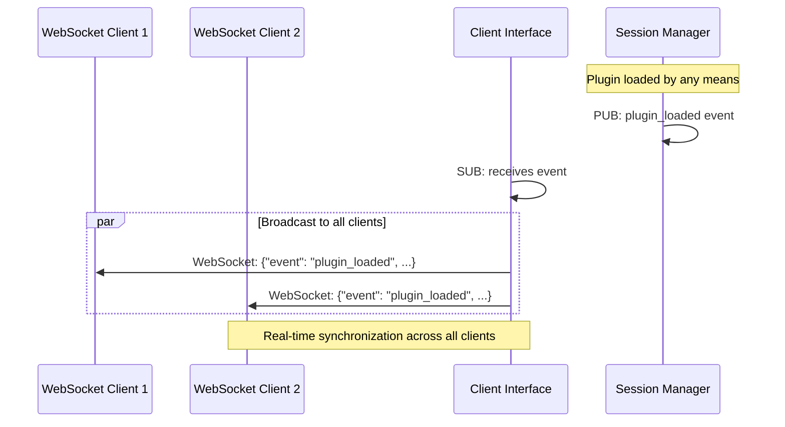

# Communication Flow Diagrams

## Plugin Loading Sequence

```mermaid
sequenceDiagram
    participant Client as Web Client
    participant CI as Client Interface  
    participant SM as Session Manager
    participant MB as Modhost Bridge
    participant MH as mod-host

    Client->>CI: POST /api/plugins {"uri": "..."}
    CI->>SM: ZMQ RPC: load_plugin(uri)
    SM->>MB: ZMQ RPC: load_plugin(uri, instance_id) 
    MB->>MH: TCP: "add <uri> <id>"
    MH-->>MB: "resp 0"
    MB-->>SM: {"success": true, "instance_id": 1}
    SM-->>CI: {"success": true, "instance_id": "1"}
    CI-->>Client: HTTP 200 {"success": true, "instance_id": "1"}
    
    Note over SM: Publish event
    SM->>SM: PUB: plugin_loaded event
    CI->>CI: SUB: receives plugin_loaded
    CI->>Client: WebSocket: {"event": "plugin_loaded", ...}
```

## Parameter Update Sequence

```mermaid
sequenceDiagram  
    participant Client as Web Client
    participant CI as Client Interface
    participant SM as Session Manager  
    participant MB as Modhost Bridge
    participant MH as mod-host

    Client->>CI: PATCH /api/plugins/parameters
    CI->>SM: ZMQ RPC: set_parameter(instance_id, port, value)
    SM->>MB: ZMQ RPC: set_parameter(instance_id, port, value)
    MB->>MH: TCP: "param_set <id> <port> <value>"
    MH-->>MB: "resp 0"  
    MB-->>SM: {"success": true}
    SM-->>CI: {"success": true}
    CI-->>Client: HTTP 200 {"success": true}
    
    CI->>Client: WebSocket: {"event": "parameter_changed", ...}
```

## Health Check Cascade  

```mermaid
sequenceDiagram
    participant Client as Web Client
    participant CI as Client Interface
    participant SM as Session Manager
    participant MB as Modhost Bridge  
    participant MH as mod-host

    Client->>CI: GET /api/session/health
    CI->>SM: ZMQ RPC: health_check()
    
    par Session Manager Checks
        SM->>MB: ZMQ RPC: health_check()
        MB->>MH: TCP: "help"
        MH-->>MB: "Available commands: ..."
        MB-->>SM: {"success": true, "status": "healthy"}
    and Plugin Manager Check
        SM->>SM: Check plugin_manager.health_check()
    and Session Check  
        SM->>SM: Check session_manager.health_check()
    end
    
    SM-->>CI: {"success": true, "components": {...}}
    CI-->>Client: HTTP 200 {"success": true, "components": {...}}
```

## Error Propagation

```mermaid
sequenceDiagram
    participant Client as Web Client  
    participant CI as Client Interface
    participant SM as Session Manager
    participant MB as Modhost Bridge
    participant MH as mod-host

    Client->>CI: POST /api/plugins {"uri": "invalid://uri"}
    CI->>SM: ZMQ RPC: load_plugin(uri="invalid://uri")
    SM->>MB: ZMQ RPC: load_plugin(uri, instance_id)
    MB->>MH: TCP: "add invalid://uri 0"
    MH-->>MB: "resp -2" (Invalid URI)
    MB-->>SM: {"error": "Invalid plugin URI", "code": -2}
    SM-->>CI: {"success": false, "error": "Invalid plugin URI"}
    CI-->>Client: HTTP 500 {"error": "Invalid plugin URI"}
```

## Real-time Event Flow

```mermaid
sequenceDiagram
    participant WS1 as WebSocket Client 1
    participant WS2 as WebSocket Client 2  
    participant CI as Client Interface
    participant SM as Session Manager

    Note over SM: Plugin loaded by any means
    SM->>SM: PUB: plugin_loaded event
    CI->>CI: SUB: receives event
    
    par Broadcast to all clients
        CI->>WS1: WebSocket: {"event": "plugin_loaded", ...}
        CI->>WS2: WebSocket: {"event": "plugin_loaded", ...}
    end
    
    Note over CI,WS2: Real-time synchronization across all clients
```