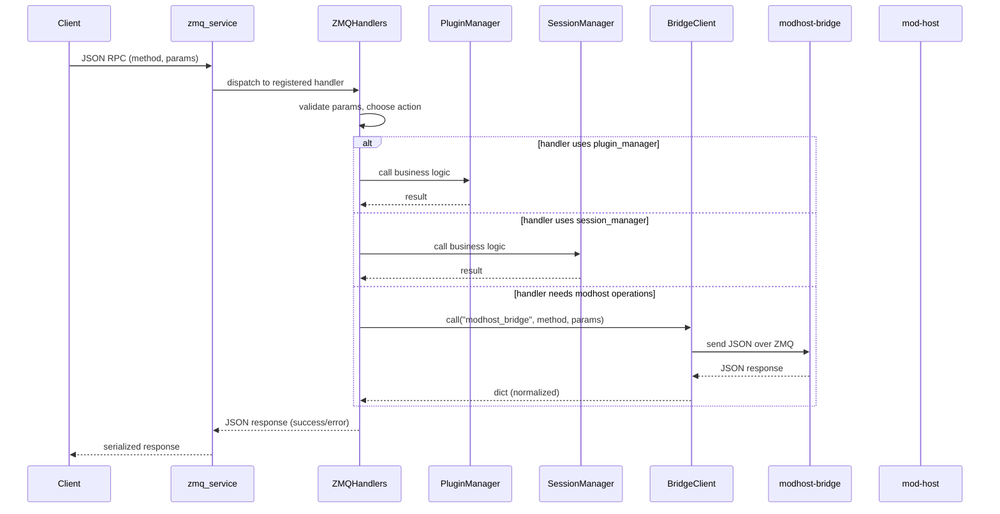

# ZMQ Handlers — request/response flow

This document shows a compact sequence diagram and explanation for how a ZeroMQ RPC request is handled by the session-manager `ZMQHandlers` layer.

Mermaid sequence diagram (GitHub and many Markdown renderers support Mermaid):



## Step-by-step explanation

1. Client sends a JSON RPC request to the `zmq_service` (the transport layer). Example payload:

```json
{
  "method": "load_plugin",
  "params": { "uri": "http://example.org/plugins/Reverb" }
}
```

2. `zmq_service` parses the request, finds the registered handler (e.g. `handle_load_plugin`), and invokes it with the request fields as kwargs.

3. The handler (a method on `ZMQHandlers`) validates required parameters. If parameters are missing it returns a failure dict such as:

```json
{ "success": false, "error": "Missing 'uri' parameter" }
```

4. If valid, the handler calls into one of the internal components:
   - `plugin_manager` for plugin-related operations
   - `session_manager` for pedalboard/session operations
   - `bridge_client` for modhost commands that must be forwarded to the C++ bridge

5. If `bridge_client` is used, the handler calls `_call_bridge()` which:
   - sends a JSON request to `modhost-bridge` via ZeroMQ
   - awaits the response with a configured timeout
   - normalizes responses so the handler receives a canonical `{"success": true, ...}` or `{"success": false, "error": "..."}` dict

6. The handler builds a final response (success or error) and returns it. Example success response:

```json
{ "success": true, "instance_id": 3, "plugin": { "uri": "..." } }
```

7. `zmq_service` serializes the returned dict and sends it back to the client.

## Error handling

- Handlers catch exceptions and return `{"success": false, "error": "..."}`. This avoids crashing the dispatcher and provides callers with useful diagnostics.
- `_call_bridge()` captures timeouts, JSON errors and other exceptions and returns a structured error dict.

## Notes for maintainers

- To add a new RPC method:
  1. Implement an async `handle_<name>` method on `ZMQHandlers` that accepts `**kwargs` and returns a dict.
  2. Register it in `register_service_methods()` using `self.zmq_service.register_handler("<name>", self.handle_<name>)`.
  3. Unit-test the handler by injecting a small mock for `plugin_manager`/`session_manager`/`bridge_client`.

- The BridgeClient uses a REQ/REP pattern. For robustness, keep bridge calls short and idempotent. If you need concurrent or long-running requests, consider a different socket pattern (DEALER/ROUTER) or add managed reconnect/backoff behaviour in `BridgeClient`.

- Example test harness pattern (unit test): create `ZMQHandlers` with simple coroutine-based mocks and call the handler directly to assert its return value.

---

If you'd like, I can also generate a PlantUML diagram PNG (requires Java/PlantUML) or add the same diagram to the repository README. Which format do you prefer for inclusion in docs or the project website?